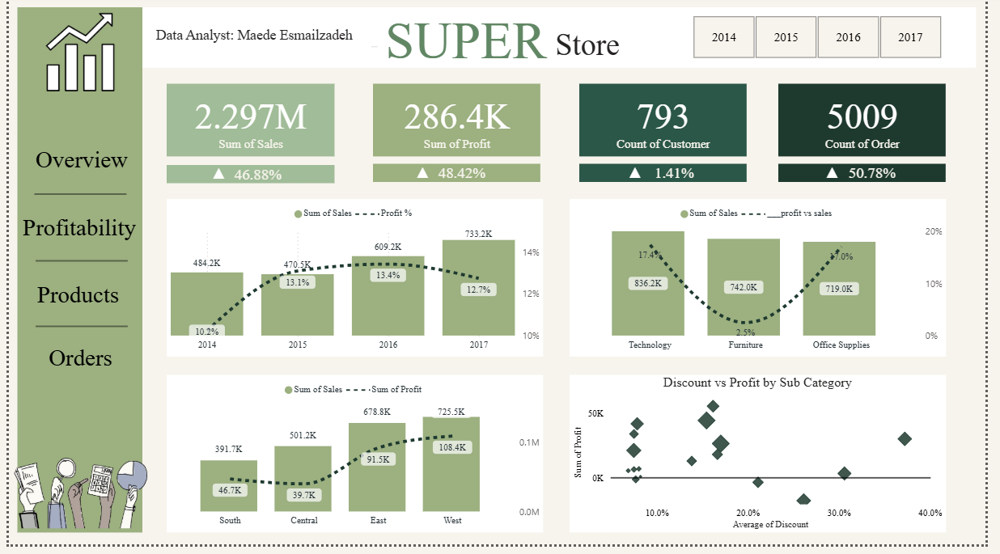
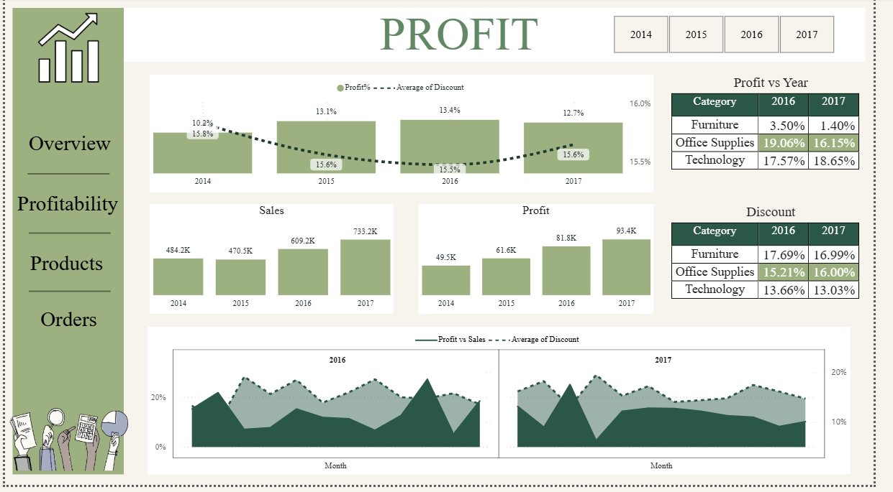
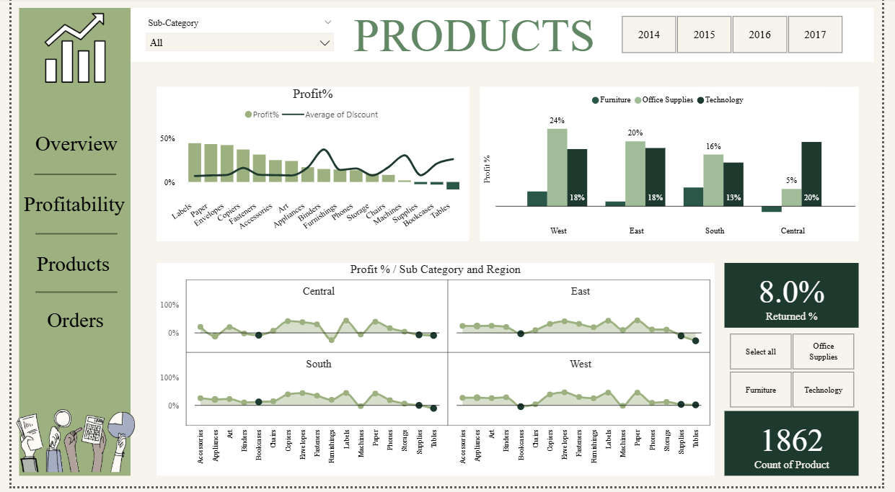
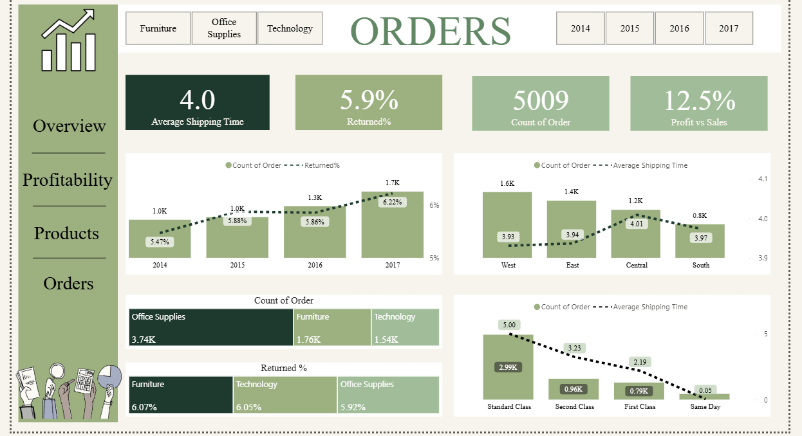
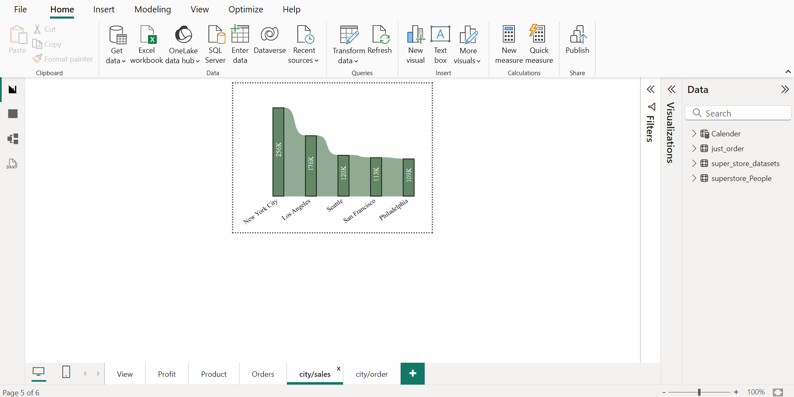

# 📊 تحلیل داده و داشبورد فروش | Superstore

## 📌 معرفی پروژه

در این پروژه، داده‌های فروش **Superstore** با استفاده از **SQL Server** و **Power BI** مورد تحلیل و بررسی قرار گرفته‌اند.

هدف اصلی پروژه، تحلیل عملکرد فروش و سودآوری، بررسی محصولات و سفارش‌ها و شناسایی الگوهای مهم در عملکرد کسب‌وکار بوده است.

در این پروژه تلاش شده است داده‌های خام به شاخص‌ها و گزارش‌های قابل فهم تبدیل شوند و نتایج تحلیل در قالب یک داشبورد تعاملی و کاربردی ارائه شوند.

---

## 🎯 اهداف تحلیل

در این پروژه به بررسی سوالاتی در زمینه عملکرد کسب‌وکار پرداخته شده است، از جمله:

* میزان فروش و سود کسب‌وکار 
* روند فروش و سود در طول زمان 
* عملکرد محصولات و دسته‌بندی‌ها 
* رابطه بین تخفیف و سودآوری 
* بررسی پرسودترین و کم سودترین دسته بندی محصولات
* میزان محصولات برگشت خورده
* وضعیت سفارش‌ها 
* میانگین زمان ارسال در سالیان متوالی و ارتباط آن با میزان سفارش
* میزان مرجوعی سفارش‌ها 
* عملکرد شهرها از نظر فروش و تعداد سفارش‌ها 

---

## 🛠️ ابزارهای استفاده‌شده

| ابزار          | کاربرد                           |
| -------------- | -------------------------------- |
| **SQL Server** | استخراج و تحلیل داده ها، ایجاد Quary و محاسبات تحلیلی |
| **Power BI**   | مدل‌سازی داده و طراحی داشبورد    |
| **DAX**        | ایجاد Measureها و محاسبات تحلیلی |

---

## 🔄 فرآیند تحلیل

فرآیند انجام پروژه شامل مراحل زیر بوده است:

**داده خام → بررسی و آماده‌سازی داده‌ها → تحلیل با SQL → مدل‌سازی در Power BI → ایجاد Measureها و KPIها → طراحی داشبورد → تحلیل نتایج**

---

## 📊 شاخص‌های کلیدی

برخی از شاخص‌های مورد استفاده در داشبورد عبارت‌اند از:

* مجموع فروش
* مجموع سود
* تعداد مشتریان
* تعداد سفارش‌ها
* سودآوری محصولات
* درصد سود نسبت به فروش
* میزان تخفیف
* میزان سود دهی هر دسته بندی در هر ناحیه جغرافیایی
* درصد سفارش‌های مرجوع‌شده
* درصد محصولات مرجوع شده
* فروش و سود در طول زمان

---

## 📈 داشبورد Power BI

داشبورد این پروژه در چند بخش طراحی شده است و هر صفحه روی جنبه متفاوتی از عملکرد کسب‌وکار تمرکز دارد.

### 🏠 صفحه نمای کلی - (Overview)


---

### 💰 صفحه تحلیل سود — (Profit)


---

### 📦 صفحه تحلیل محصولات — (Products)


---

### 🛒 صفحه تحلیل سفارش‌ها — (Orders)


---

## 🔎 Tooltip

این بخش به کاربر اجازه می‌دهد هنگام بررسی داده‌ها، اطلاعات جزئی‌تری درباره عملکرد شهرها مشاهده کند.

---
## 💡 Insights

تحلیل داده‌های Superstore امکان شناسایی روندهای فروش و سودآوری، بررسی عملکرد محصولات، ارزیابی تأثیر تخفیف بر سود و همچنین بررسی وضعیت سفارش‌ها و مرجوعی‌ها را فراهم کرده است.

یکی از بخش‌های مهم این پروژه، بررسی ارتباط میان **Discount و Profit** است که می‌تواند به شناسایی شرایطی کمک کند که در آن افزایش تخفیف الزاماً به افزایش سود منجر نمی‌شود.

---

## 📁 ساختار پروژه

```text
superstore-sales-analysis/
│
├── README.md
│
├── PowerBI/
│   └── Super_store.pbix
│
├── SQL/
│   └── Super_store_queries.sql
│
└── Images/
    ├── dashboard-overview-page.png
    ├── dashboard-Profitability-page.png
    ├── dashboard-products-page.png
    ├── dashboard-orders-page.png
    └── tooltip-1.png
```

---

## 👤 درباره پروژه

این پروژه **دومین نمونه‌کار من در مسیر حرفه‌ای Data Analysis و Business Intelligence** است.

در این پروژه، مهارت‌های خود را در زمینه کار با ** SQL Server، Power BI و DAX** به‌کار گرفته‌ام و فرآیند تحلیل داده را از بررسی داده‌های خام و ایجاد Queryهای تحلیلی تا مدل‌سازی، ایجاد Measureها و طراحی داشبورد تجربه کرده‌ام.

### مهارت‌های به‌کاررفته

 `SQL Server` · `Power BI` · `DAX` · `Data Analysis` · `Data Visualization` · `Business Intelligence`
